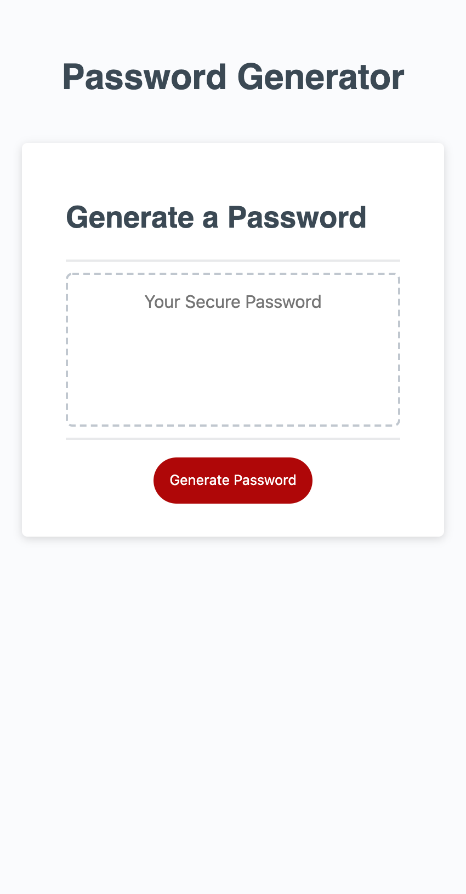

# Password Generator (friendly-parakeet homework assignment)

This is a website that will randomly create a password that is between 8-128 characters long. 
It allows the user to choose uppercase characters, lowercaser characters, special characters or numeric characters. 
If none of these are chosen it prompts the user to start over and pick at lease one of the options.
Upon completion it displays the new secure password on the screen.

[link to my website](https://ryannekillian.github.io/friendly-parakeet/)

